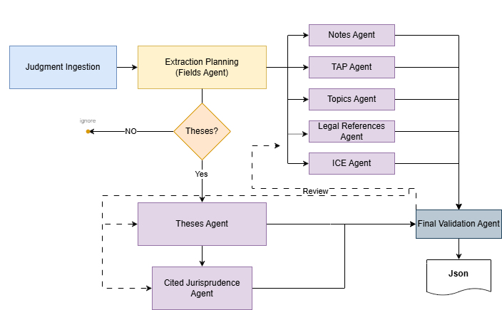

# JAMEX: Judicial Multi-Agent Metadata Extraction

## PROPOR 2026

> Replication package for the paper published at **PROPOR 2026** — *17th International Conference on Computational Processing of Portuguese*.

The **17th International Conference on Computational Processing of Portuguese (PROPOR 2026)** is the premier scientific venue for language and speech technologies applied to Portuguese and Galician. The 2026 edition will be held in **Salvador, Brazil, from April 13–16, 2026**.
PROPOR is a biennial event held alternately in Brazil and Portugal (and now Galicia), with a tradition dating back to 1993. More information at [propor2026.ufba.br](https://propor2026.ufba.br/) and [propor.org](https://propor.org).

📄 **Paper:** _in progress_

---

## Abstract

This work proposes and evaluates **JAMEX** (Judicial Multi-Agent Metadata Extraction), a multi-agent pipeline for extracting structured metadata from Brazilian court decisions (*Espelho do Acórdão*), and compares it against a strong single-prompt baseline under an IR-only setting.

We first ran a pilot on 300 decisions and then re-executed the experiment on a stratified dataset of *n* = 1,225; only 735 instances were completed by all evaluated models, so paired comparisons use this common set (*n* = 735). Across re-executions, the accuracy impact of agents was strategy-dependent: GPT-5 improves in multiple agentic strategies but not across all orchestration variants, while smaller models (Gemma 3 12B/27B) show no robust gains and reduce the comparable set due to non-completion. Orchestration refinements motivated by agent design literature (memory, planning, directed review) improved traceability, but performance remained sensitive to task decomposition and context fragmentation. Overall, JAMEX increases token usage and operational complexity, so deployment must balance accuracy, completion reliability, and cost for Portuguese legal metadata extraction.

---

## Overview

**JAMEX** is a multi-agent orchestration pipeline for structured metadata extraction from Brazilian Portuguese appellate court decisions (*acórdãos*). It decomposes the extraction task across specialist agents with explicit planning, dependency-aware execution, schema validation, and directed review — communicating exclusively through JSON objects for auditability and reproducibility.

This repository contains all code used in the experiments reported in the paper, including dataset preparation, the baseline single-prompt approach, the JAMEX pipeline, and the evaluation protocol.

---

## Architecture

  > *Figure: JAMEX multi-agent orchestration pipeline — specialist agents with planning, dependency-aware execution, schema validation, and directed review communicate exclusively through JSON objects.*

---

## Experimental Setup

| Component         | Specification                                      |
|-------------------|----------------------------------------------------|
| CPU               | Intel® Core™ i7-13700T (13th Gen) @ 1.40 GHz      |
| RAM               | 32 GB DDR5 (usable: 31.6 GB)                       |
| Storage           | SSD 954 GB                                         |
| OS                | Windows 11 Enterprise 24H2 + WSL2 (Debian 11)      |
| Python            | 3.13                                               |
| Models evaluated  | GPT-5 (OpenAI), Gemma 3 12B, Gemma 3 27B           |

---

## Models

Three LLMs were evaluated under both the single-prompt baseline strategy and the JAMEX multi-agent pipeline:

- **GPT-5** (OpenAI, proprietary) — API access, context window 256k tokens, medium reasoning effort for LLM-as-a-Judge and low reasoning effort for agents/baseline.
- **Gemma 3 12B** (Google DeepMind, open weights) — optimized for GPU/TPU execution, 128k context window.
- **Gemma 3 27B** (Google DeepMind, open weights) — same family, larger capacity.

---

## Dataset

Experiments were conducted on a stratified sample of **n = 1,225** legal appellate decisions (*acórdãos* — Brazilian collegiate court rulings) from the **Superior Tribunal de Justiça (STJ)** official open data portal, covering the period January 1, 2023 – December 31, 2024.

### Sample Selection

Candidate decisions were identified through the STJ internal jurisprudence index (*Summa*), which provides structured metadata including `seq_documento_acordao`, publication date, and class information. The sample was restricted to decisions published on the *Diário da Justiça Eletrônico* (DJe) and indexed with at least one valid *espelho do acórdão* entry in the CKAN open data portal.

A semantic diversity filter was applied using cosine similarity (θ = 0.15) on domain-specific embeddings to reduce near-duplicate documents and increase corpus variance. 

### Obtaining the Full Texts

The full text of each decision is **not stored in this repository**. To reproduce the dataset used in the paper, run the data preparation notebook, which downloads each decision's full text directly from the STJ Open Data Portal using the `seq_documento_acordao` identifier:

The notebook (`notebooks/01_data_preparation.ipynb`) performs the following steps:

1. Loads `espelhos_acordaos_artigo2026.parquet` — the index file with the 1,225 selected decisions and their identifiers (`seq_documento_acordao` and `num_registro`). A computed field `id_peca` (format: `seq_documento_acordao + '.' + ano + '.'`, e.g. `188798478.2023.`) is derived within the notebook and used as the document identifier throughout the experiment pipeline.
2. Connects to the CKAN dataset [`integras-de-decisoes-terminativas-e-acordaos-do-diario-da-justica`](https://dadosabertos.web.stj.jus.br/dataset/integras-de-decisoes-terminativas-e-acordaos-do-diario-da-justica) and lists available ZIP files; separately, queries the per-*órgão julgador* mirror datasets to list available JSON files.
3. Filters ZIP and JSON files by the years present in the sample (e.g., `2023`, `2024`) to avoid unnecessary downloads.
4. Streams each ZIP, extracts only the `.txt` files whose names match a `seq_documento_acordao` in the sample, and maps the full-text content back to the dataframe.
5. Downloads and processes each mirror JSON, filtering records by `num_registro` and joining structured metadata fields (`teseJuridica`, `tema`, `referenciasLegislativas`, `jurisprudenciaCitada`, `notas`, `termosAuxiliares`, `informacoesComplementares`, etc.) back to the dataframe via `seq_documento_acordao`.
6. Saves the enriched dataset to `espelhos_acordaos_artigo2026_com_texto.parquet`.

Downloaded ZIPs are cached locally in `notebooks/downloads_stj/` and mirror JSONs in `notebooks/downloads_stj/espelhos/`, so subsequent runs do not re-download files already present.

**Data availability:** The dataset is **not distributed directly** in this repository. Texts are fetched on demand from the [STJ Open Data Portal](https://dadosabertos.web.stj.jus.br/group/jurisprudencia), ensuring compliance with access policies and data governance requirements enforced by the portal at the time of download.

This approach ensures that:
- Data is always fetched from the authoritative source.
- Users comply with the STJ Open Data Portal's current terms and policies.
- No court decision content is redistributed without authorization.

---

## Usage

### Running the baseline

_in progress_

### Running JAMEX

_in progress_

### Reproducing evaluation metrics

_in progress_

See the notebooks in `notebooks/` for step-by-step replication of all paper results.

---

## Research Questions

| RQ | Question |
|----|----------|
| **RQ1** | Does a multi-agent pipeline yield higher field-level extraction quality than a single strong prompt under IR-only context? |
| **RQ2** | Does agentic orchestration improve operational robustness without prohibitive efficiency penalties? |
| **RQ3** | Which extraction fields benefit most from agent specialization? |

**Hypotheses:** H0: µ(Base F1) ≥ µ(Agent F1) vs. H1: µ(Base F1) < µ(Agent F1)

---

## Results

> Full results are presented in the paper.

---

## Citation

If you use this code or dataset in your research, please cite:

_in progress_

---

## License

This project is licensed under the **MIT License** — see the [LICENSE](LICENSE) file for details.

The dataset derived from STJ public records is subject to the terms of the [STJ Open Data Portal](https://dadosabertos.web.stj.jus.br). Ground truth metadata was produced under institutional standards of the STJ indexing division and is provided here for research reproducibility only.

---

## Acknowledgements

This work originated as a capstone project (*Trabalho de Conclusão de Curso*) of the Specialization in Data Science at **Pontifícia Universidade Católica do Paraná (PUCPR)**, where two of the authors are currently enrolled in the Master's program in Computer Science. We thank **PUCPR** for the academic environment and institutional support that made this work possible.

We gratefully acknowledge the **Superior Tribunal de Justiça (STJ)** for making their appellate decisions publicly available through the [Open Data Portal](https://dadosabertos.web.stj.jus.br/group/jurisprudencia) and for the institutional support that made this research possible.

We also thank the **Coordenação de Aperfeiçoamento de Pessoal de Nível Superior (CAPES)** for supporting scientific research and for fostering the training and development of graduate researchers and faculty across Brazil.
